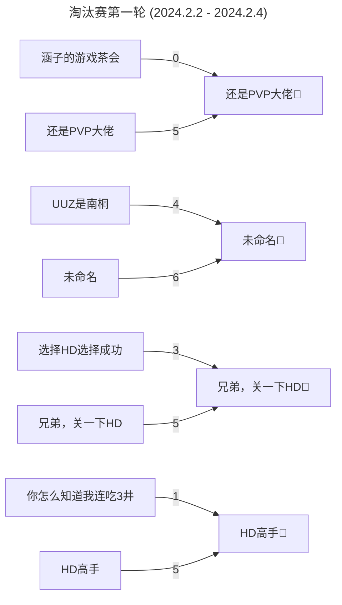
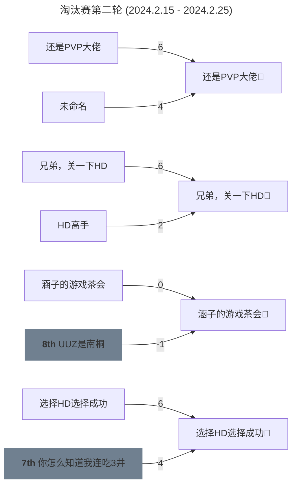

## 总览

YHC S4 于 2024 年 1 月 5 日 开始，2024 年 3 月 10 日 结束。

比赛共有 88 人报名，实际参赛 66 人。

图池共计三轮，分别是淘汰赛第一轮、淘汰赛第二轮、淘汰赛第三轮。

<!-- more -->

## 详情

### 日程

|         日期         |             行程             |
| :-------------------: | :--------------------------: |
| 2024.1.5 - 2024.1.19 |             报名             |
|       2024.1.26       | 宣布参赛选手和分组、教练选队 |
|       2024.1.26       |     淘汰赛第一轮图池展示     |
|  2024.2.2 - 2024.2.4  |         淘汰赛第一轮         |
|       2024.2.11       |     淘汰赛第二轮图池展示     |
| 2024.2.15 - 2024.2.25 |         淘汰赛第二轮         |
|       2024.2.26       |     淘汰赛第三轮图池展示     |
| 2024.3.2 - 2024.3.10 |         淘汰赛第二轮         |

### 图池

### 淘汰赛第一轮

<Mappool :mapData="poolList.pool1.data" :status="poolList.pool1.status"></Mappool>

<!-- [在这里下载谱面包！](https://drive.google.com/file/d/16EGRC4DnalO_YEiENcBLBTi9H05XcHiE/view?usp=share_link) -->

<!-- !gp #YHC S4 R1# HD 2089366 372448 3239199 3448129 3902695 2141049 NM 2661092 3743459 DT 3675891 2587641 FM 3424391 3521488 3139469 TB 3256904 -->

### 淘汰赛第二轮

<Mappool :mapData="poolList.pool2.data" :status="poolList.pool2.status"></Mappool>

<!-- !gp #YHC S4 R2# HD 3295947 3535432 2892338 2434770 4313545 4253149 NM 3794164 2278423 DT 3334117 4362204 FM 2273016 2794470 4093505 TB 1968981 -->

<!-- ### 淘汰赛第三轮 -->

<!-- <Mappool :mapData="poolList.pool3.data" :status="poolList.pool3.status"></Mappool> -->

<!-- !gp #YHC S4 R3# HD 3468294 3113813 3735247 3196719 2381878 2938608 313165 NM 3017432 3157972 DT 307804 2896899 2325564 FM 1542345 3661739 2033671 TB 342543 -->

### 对阵

:::note
2024 年 2 月 18 日，由于 A-UUZ是南桐 中有 2 位选手的账号被限制（几乎同时），且并未在 24h 后自动解封，并且在前两场比赛（#2 和 #7）中几乎 100% 上场，严重影响了竞技公平性。现按照 owc 往届做法，判定 #7 结果作废，并取消 A 队资格，F-涵子的游戏茶会 进入下一轮比赛。
:::

<!-- ### 结果

| 名次 |        队伍        |                                                                                                                                                                                                队员                                                                                                                                                                                                |                       教练                       |                       奖励                       |
| :--: | :-----------------: | :-------------------------------------------------------------------------------------------------------------------------------------------------------------------------------------------------------------------------------------------------------------------------------------------------------------------------------------------------------------------------------------------------: | :----------------------------------------------: | :-----------------------------------------------: |
|  #1  |         ??         |                                       [*innnnovation*](https://osu.ppy.sh/users/18443135) [Natsukaze](https://osu.ppy.sh/users/29046592) [Refu3](https://osu.ppy.sh/users/24013879) [eric1388](https://osu.ppy.sh/users/20384257) [TomCh](https://osu.ppy.sh/users/13863127) [ElectroTD](https://osu.ppy.sh/users/6955595) [Kallen0401](https://osu.ppy.sh/users/32620473)                                       |   [VialVistas](https://osu.ppy.sh/users/9697708)   | 每人一份随机零食[^first]、非官方主页奖牌[^second] |
|  #2  |         ??         |                                       [*7R1N1TY*](https://osu.ppy.sh/users/12803951) [SouJuku](https://osu.ppy.sh/users/20403654) [Asp1er](https://osu.ppy.sh/users/17392497) [zhuiyi_crane](https://osu.ppy.sh/users/24365691) [MizukiQwQ](https://osu.ppy.sh/users/15154497) [Fungus OVO](https://osu.ppy.sh/users/4928835) [Lfruin](https://osu.ppy.sh/users/18165022)                                       |     [Kotor1](https://osu.ppy.sh/users/2351439)     |                    每人 25 CNY                    |
|  #3  |         ??         |                                           [*n0000000000o*](https://osu.ppy.sh/users/12215328) [yukishize](https://osu.ppy.sh/users/11736169) [cd20200816](https://osu.ppy.sh/users/18118155) [EYii](https://osu.ppy.sh/users/26977726) [FiresunX](https://osu.ppy.sh/users/25578225) [Aokreti](https://osu.ppy.sh/users/27321919) [akuya](https://osu.ppy.sh/users/25089015)                                           |  [Celia-Claire](https://osu.ppy.sh/users/12790121)  |                    每人 15 CNY                    |
|  #4  |         ??         |                                 [*Niumaokun*](https://osu.ppy.sh/users/16227180) [Alymetic](https://osu.ppy.sh/users/19287762) [LingYuanOvO](https://osu.ppy.sh/users/23805648) [1224192602](https://osu.ppy.sh/users/13089663) [lizhanyiawa](https://osu.ppy.sh/users/13928307) [CyberBunnyGirl](https://osu.ppy.sh/users/11531025) [magic__sunny](https://osu.ppy.sh/users/13323610)                                 | [-Spring Night-](https://osu.ppy.sh/users/17064371) |                        --                        |
|  #5  |         ??         |                                               [*fate80016*](https://osu.ppy.sh/users/8471476) [rtconsuming](https://osu.ppy.sh/users/8500047) [MAPSILL](https://osu.ppy.sh/users/31956309) [FeD4kTo](https://osu.ppy.sh/users/31483691) [SansX](https://osu.ppy.sh/users/29735986) [iz6](https://osu.ppy.sh/users/26093361) [Dawintch](https://osu.ppy.sh/users/9948405)                                               |   [Stick_Fish](https://osu.ppy.sh/users/13358640)   |                        --                        |
|  #6  |         ??         |                                                     [*Kieost*](https://osu.ppy.sh/users/17823832) [sion22](https://osu.ppy.sh/users/30137844) [Zxian](https://osu.ppy.sh/users/20672564) [xxbg](https://osu.ppy.sh/users/31833376) [chana](https://osu.ppy.sh/users/18375016) [Lemen](https://osu.ppy.sh/users/28120802) [K_vAE](https://osu.ppy.sh/users/8756045)                                                     |   [Sakura Luna](https://osu.ppy.sh/users/1608105)   |                        --                        |
|  #7  | 你怎么知道我连吃3井 | [*cdwcgt*](https://osu.ppy.sh/users/14721101) [wjs255](https://osu.ppy.sh/users/29856978) [qazoop](https://osu.ppy.sh/users/16833395) [Maihama Alice](https://osu.ppy.sh/users/29164007) [AltoClef](https://osu.ppy.sh/users/27673654) [Ryno](https://osu.ppy.sh/users/25095822) [sourflour](https://osu.ppy.sh/users/5237349) [Swlloy](https://osu.ppy.sh/users/32977609) [Krazy Dragon](https://osu.ppy.sh/users/26954594) |  [ShandenOnter](https://osu.ppy.sh/users/13999223)  |                        --                        |
|  #8  |      UUZ是南桐      |                 [*mura sama*](https://osu.ppy.sh/users/9527178) [C9NekoMinto](https://osu.ppy.sh/users/12971970) [-Yuuk1-](https://osu.ppy.sh/users/33746988) [Hinanawi Momoko](https://osu.ppy.sh/users/16901335) [ILOVEUUZ](https://osu.ppy.sh/users/14285752) [CherryBomb](https://osu.ppy.sh/users/1992984) [CNjoin](https://osu.ppy.sh/users/13630983) [Yoizuki](https://osu.ppy.sh/users/25767690)                 |   [BurgerKing](https://osu.ppy.sh/users/13013147)   |                        --                        |

---

[^first]: 随机零食花费通常在 30 - 40 CNY 之间，S3 的随机零食是**百奇Pocky、喜茶气泡水**。
       经协商后，#1 部分选手的奖励兑换成 35 CNY 或 一个月 osu!supporter 。

[^second]: 非官方主页奖牌为 [KanonBot](https://info.desu.life/?p=383) 徽章
       :::center
       
       ::: -->

